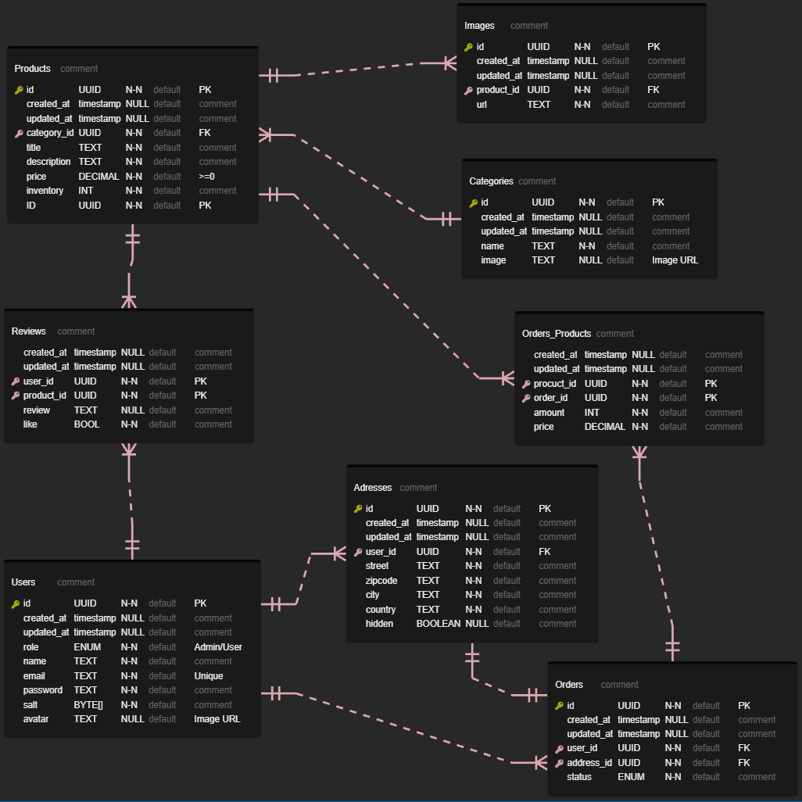

# Fullstack Project


This project involves creating a Fullstack project with React and Redux in the frontend and ASP.NET Core 7 in the backend. The goal is to provide a seamless experience for users, along with robust management system for administrators.

### Frontend

-   Technologies used: TypeScript, React, Redux Toolkit
-   Github repo: https://github.com/Noutaja/fs16_6-frontend-project
-   Public deployment: https://noutaja.github.io/fs16_6-frontend-project/#/

### Backend

-   Technologies used: ASP.NET Core, Entity Framework Core, PostgreSQL
-   Github repo: This page
-   Swagger documentation: https://noutaja-scuffed-webstore.azurewebsites.net/index.html
-   API url: https://noutaja-scuffed-webstore.azurewebsites.net/api/v1/

## Table of Contents

1. [Getting started](#getting-started)
2. [Structure](#structure)
    - [ERD](#erd)
3. [Features](#features)
4. [Testing](#testing)

# Getting started

## Requirements

-   Dotnet 8: https://dotnet.microsoft.com/en-us/download
-   Local or online database access: https://neon.tech/ as a free example.

## Running the project

1. Clone this repo with `git clone https://github.com/Noutaja/fs16_CSharp-FullStack.git`
2. Run command `dotnet restore` to install all required packages
3. Create local `appsettings.json` file
4. Add to `appsettings` and customize the `RemoteDb` string with this syntax: `"RemoteDb": "Host=;Database=;Username=;Password="`
5. Add to `appsettings` and customize the `Jwt`:`Issuer`, `Audience` and `Key`
6. Add to `appsettings` the initial admin account:
    ```
    "Admin": {
    	"FirstName": string,
    	"LastName": string,
    	"Email": login email,
    	"Password": string,
    	"Avatar": url,
    	"Role": "Admin"
    }
    ```
7. Run command `dotnet ef migrations add Create`
8. Run command `dotnet ef database update`
9. Start the project in the `ScuffedWebstore.Framework` folder with `dotnet run` or `dotnet watch` (recommended)

# Structure

The project structure follows CLEAN architechture:

```
.
├── Documents
|  └── ERD
|     ├── ERD.png
|     └── ScuffedWebstore.vuerd.json
├── fs16_CSharp-FullStack.sln
├── README.md
├── ScuffedWebstore.Controller
|  ├── ScuffedWebstore.Controller.csproj
|  └── src
|     └── Controllers
|        ├── AddressController.cs
|        ├── AuthController.cs
|        ├── BaseController.cs
|        ├── CategoryController.cs
|        ├── OrderController.cs
|        ├── ProductController.cs
|        └── UserController.cs
├── ScuffedWebstore.Core
|  ├── ScuffedWebstore.Core.csproj
|  └── src
|     ├── Abstractions
|     ├── Entities
|     |  ├── Address.cs
|     |  ├── BaseEntity.cs
|     |  ├── Category.cs
|     |  ├── Image.cs
|     |  ├── Order.cs
|     |  ├── OrderProduct.cs
|     |  ├── OwnedEntity.cs
|     |  ├── Product.cs
|     |  ├── Review.cs
|     |  ├── Timestamp.cs
|     |  └── User.cs
|     ├── Parameters
|     └── Types
|        ├── OrderStatus.cs
|        └── UserRole.cs
├── ScuffedWebstore.Framework
|  ├── ScuffedWebstore.Framework.csproj
|  └── src
|     ├── Authorization
|     ├── Database
|     ├── Middlewares
|     ├── Program.cs
|     ├── Repositories
|     |  ├── AddressRepo.cs
|     |  ├── BaseRepo.cs
|     |  ├── CategoryRepo.cs
|     |  ├── ImageRepo.cs
|     |  ├── OrderRepo.cs
|     |  ├── ProductRepo.cs
|     |  └── UserRepo.cs
|     └── Services
|        └── TokenService.cs
├── ScuffedWebstore.Service
|  ├── ScuffedWebstore.Service.csproj
|  └── src
|     ├── Abstractions
|     ├── DTOs
|     ├── Services
|     |  ├── AddressService.cs
|     |  ├── AuthService.cs
|     |  ├── BaseService.cs
|     |  ├── CategoryService.cs
|     |  ├── OrderService.cs
|     |  ├── ProductService.cs
|     |  └── UserService.cs
|     └── Shared
└── ScuffedWebstore.Test
   ├── ScuffedWebstore.Test.csproj
   └── src
      ├── AddressServiceTest.cs
      ├── AuthServiceTest.cs
      ├── CategoryServiceTest.cs
      ├── OrderServiceTest.cs
      ├── ProductServiceTest.cs
      └── UserServiceTest.cs
```

## ERD



# Features

## User Features

1. User Management: Users can register for an user account and log in. Users cannot register themselves as admin.
2. Browse Products: Users can view all available products and single product, search and sort products (handled in the frontend).
3. Add to Cart: Users can add products to a shopping cart, and manage cart.
4. Checkout: Users can place orders.
5. User Management: Users can view and edit only certain properties in their accounts. They also can unregister their own accounts.
6. Order Management: Users can view their order history, track the status of their orders, and cancel orders when they are `Pending`.

## Admin Features

1. User Management: Admins can view and delete users.
2. Product Management: Admins can view, edit, delete and add new products.
3. Order Management: Admins can view all orders.
4. User Management: Admins can edit users' role and create new users and admins.
5. Order Management: Admins can update order status, view order details, and cancel orders.

## Swagger

Swagger documentation can be found at https://noutaja-scuffed-webstore.azurewebsites.net/index.html

# Testing

Unit testing made with xUnit and Moq on the service layer.
To run the tests, use command `dotnet test`
